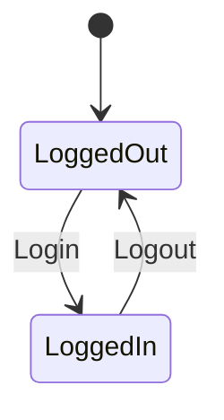
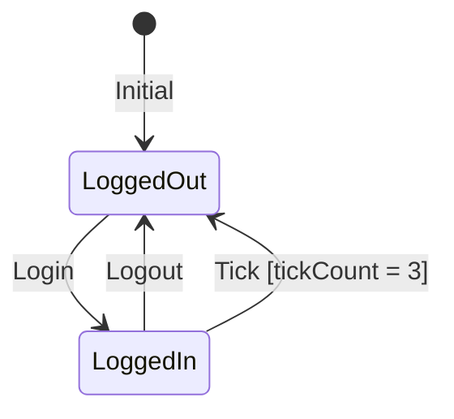
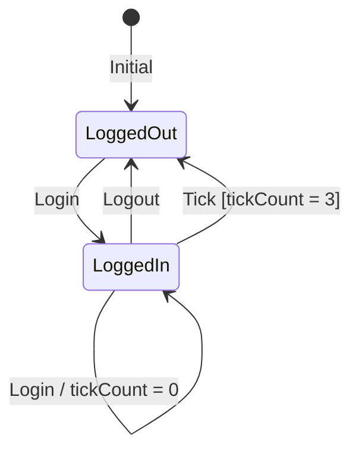
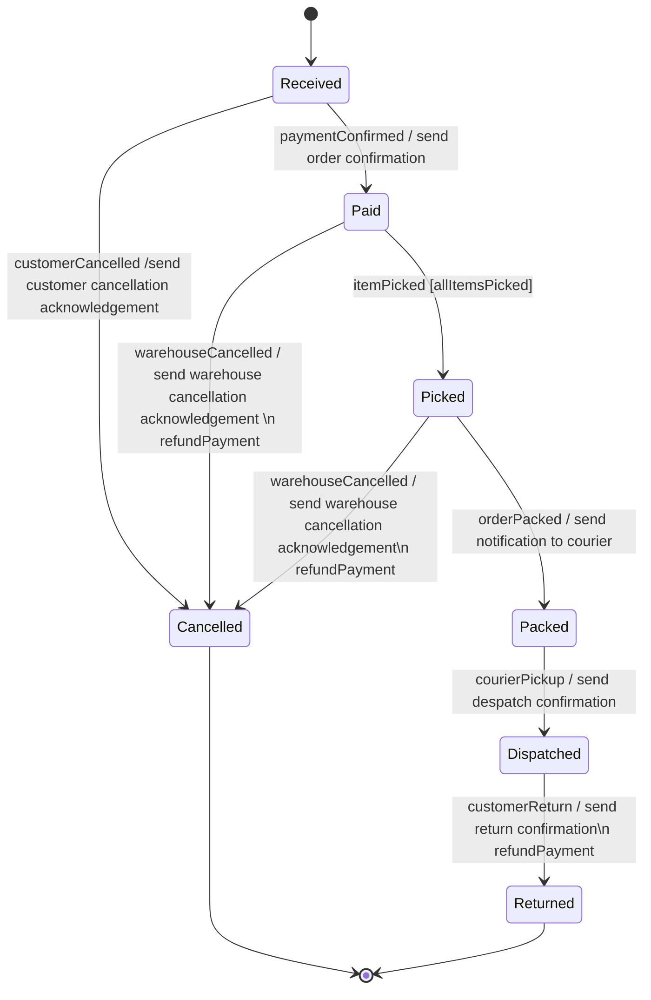

# Software Design and Architecture Week07 Lab 01 Worksheet

# Using the State Pattern to manage Authentication status.

Many websites and apps work in two modes, an unauthenticated mode (any user is logged out) and an authenticated mode (user is logged in).

For example, many ecommerce websites allow browsing and shopping (adding products to a basket) but require the user to be logged in to check out, so that that order is associated with the correct user account (we will ignore the registration of a new user for now).

In this lab we will implement a simple Authentication context that keeps track of the authentication state using the State pattern.

## Handling Login and Logout using the State Pattern

The first part of the lab is to build a simple context class that handles login and logout. The state transition table is trivial, and for this part of the lab we won’t take any actions on the state transition.




| Current State | Trigger | Next State | Action(s) |
|---------------|---------|------------|-----------|
| LoggedOut     | Login   | LoggedIn   | n/a       |
| LoggedIn      | Logout  | LoggedOut  | n/a       |

The state machine should ignore  **Login** triggers when the current state is **LoggedIn** and ignore **Logout** triggers when the current state is **LoggedOut**.

Create a new Java project using:

Intelli-J File menu -\> New \> Project. Provide a project name, chose a location and ensure that you have ticked the **Add sample code** box.

We are going to create two concrete State classes, one for each state in the state machine (lets call them LoggedInState and LoggedOutState).

The State interface to be implemented by each concrete state class

```java
interface State {
    void login(Context context);
    void logout(Context context);
}
```
The Context interface to be implemented by the concrete **context** class.

```java
interface Context {
    void setState(State state);

```

The two concrete State classes override the methods in the State interface to handle the events that trigger state transitions.
For convenience, we will override the toString() method so that we can easily print the current state.

```java

class LoggedInState implements State {

    @Override
    public void login(Context context) {
        //already logged in, so ignore
    }

    @Override
    public void logout(Context context) {
        context.setState(new LoggedOutState());
    }

    @Override
    public String toString() {
        return "Logged In";
    }
}


class LoggedOutState implements State {
    @Override
    public void login(Context context) {
        context.setState(new LoggedInState());
    }

    @Override
    public void logout(Context context) {
        //already logged out
    }

    @Override
    public String toString() {
        return "Logged Out";
    }
}

```


Create an AuthenticationContext class with the following API

```java
class AuthenticationContext implements Context{

    public void login()
    public void logout()
    @Override
    public void setState(State state)
    public String getStatus()
}
```
The getStatus() method should return a string indicating if the current state is LoggedIn or LoggedOut.

Use the State pattern to implement the state machine shown above to move between the **LoggedIn** and **LoggedOut** states.

The AuthenticationContext should start in the LoggedOut state.

A test program

```java
        AuthenticationContext context = new AuthenticationContext();
        System.out.format("User is %s%n", context.getStatus());

        System.out.format("Login%n");
        context.login();
        System.out.format("User is %s%n", context.getStatus());

        System.out.format("Login when already logged in%n");
        context.login();
        System.out.format("User is %s%n", context.getStatus());

        System.out.format("Logout%n");
        context.logout();
        System.out.format("User is %s%n", context.getStatus());

        System.out.format("Logout when already logged out%n");
        context.logout();
        System.out.format("User is %s%n", context.getStatus());

        System.out.println();
```

Should generate the following output:
```Text
User is Logged Out
Login
User is Logged In
Login when already logged in
User is Logged In
Logout
User is Logged Out
Logout when already logged out
User is Logged Out
```

## Hints and Tips

A common requirement in software design is to represent things that have a lifecycle, and for an object's state to vary over time. It is a very useful design technique to model the sequence of states as a State Machine. We are using the State pattern to code up a State Machine.

The state pattern has a ConcreteContext (this is the class that hosts the State) and one or more concrete States. The ConcreteContext provides the client interface, and passes each client request as a triggering event to the current Concrete State object to handle.

The two interfaces needed are the Context interface (used by the State classes to set the current state) and the State interface (implemented by each concrete State class).

```java
interface Context {
    void setState(State state);
}
```

```java
interface State {
    void handle(Context context);
}
```
We have concrete State classes that implement the State interface.

```java
class ConcreteStateA implements State {
    @Override
    public void handle(Context context) {
        context.setStatus(new ConcreteStateB());
    }
}

```

```java
class ConcreteStateB implements State {
    @Override
    public void handle(Context context) {
        context.setStatus(new ConcreteStateA());
    }
}
```

Finally, the ConcreteContext holds the current state and passes on triggering events.

```java
class ConcreteContext implements Context {
    private State status;

    ConcreteContext(State initialState) {
        status = initialState;
    }

    @Override
    public void setStatus(State state) {
        this.status = state;
    }

    public void request() {
        this.status.handle(this);
    }
}
```

To code a UML State Transition Diagram using the State pattern, each State shown in the diagram becomes a concrete State class.

The transitions are shown as a line between source and target states.

`Source --> Target `

The arrow indicates the direction of the transition from source to target

Transitions are labelled `e[g]/A`

  - The triggering event `e` triggers the transition and becomes a method on the abstract State interface, and must be implemented by each concrete State class.

  - An optional boolean guard condition `g` is evaluated when the event e occurs. If the guard condition evaluates true then the transition can happen, if false the transition is blocked. Guard conditions can use any data available to it to make the decision.

  - Activity, Action or Actions `A` are the effect of the transition. If the transition was blocked by a guard condition, then the action is not taken and there is no effect.

In this lab there are only two States, LoggedIn and LoggedOut. The process of leaving one State and arriving at another is called a State Transition.

Transitions are triggered by some event, in this case there are Login, Logout or Tick events (in the later labs) which become the abstract methods on the interface that every concrete State

Another ways of modelling a State Machine is a State Transition Table. There are lots of ways of organising the table, but the basic concept is that it shows the current state, an event that triggers a transition (with Guard condition), the next (or target) state and any actions taken because of the transition from the current state to the next state.

The State Transition Table tells us what the concrete States are (the set of States listed in the Current and Next State columns become concrete State classes) and the triggering events become methods on the abstract State interface.

## Implement Auto Logout using the State Pattern

Some websites (banking applications for example) automatically log the user out after some time period as a security measure. We can simulate this by adding a tick() method to the AuthenticationContext which is called on a regular basis.

```java
class AuthenticationContext implements Context {

    public void login()
    public void logout()
    public void tick()
     @Override
    public void setState(State state)
    public String getStatus()
}
```

Extend the state interface and the state machine so that when the 3rd tick is received AND the state is logged in, the state is automatically changed to logged out. Ticks received when in the logged-out state are ignored.


The state transition table gains an additional Tick trigger. The number of ticks is counted by the Logged in state and there a guard condition on the Tick trigger when in the Logged in state that prevents the transition to Logout unless the tickCount = 3.

| Current State | Trigger             | Next State | Action(s) |
|---------------|---------------------|------------|-----------|
| LoggedOut     | Login               | LoggedIn   | n/a       |
| LoggedIn      | Logout              | LoggedOut  | n/a       |
| LoggedIn      | Tick[tickCount = 3] | LoggedOut  | n/a       |

A test program

```java
System.out.println("Auto Logout Example");
AuthenticationContext context = new AuthenticationContext();
context .login();
System.out.format("User is %s%n", context.getStatus());

for(int i = 0; i < 5; i++) {
    System.out.format("Tick%n");
    context.tick();
    System.out.format("User is %s%n", context.getStatus());
}
```
Should generate the following output

```Text
Login
User is Logged In
Tick
User is Logged In
Tick
User is Logged In
Tick
User is Logged Out
Tick
User is Logged Out
Tick
User is Logged Out
```

## Implement Auto Logout with Reset using the State Pattern

As a final enhancement, extend the state machine so that a Login trigger when in the Login state resets the tick counter, so that additional time is granted if the user re-authenticates. This reset is shown as an action on the Login trigger from the LoggedIn state (the LoggedIn state is both the source and target State in this case).



Note that `[tickCount = 3]` is a **guard condition**. On reciept of the trigger, the transition does not happen unless the guard condition evaluates true.

`/ tickCount = 0` is an **action**, when the transition happens, the action is executed, in this case resetting the tickCount to 0.


| Current State | Trigger             | Next State | Action(s)            |
|---------------|---------------------|------------|----------------------|
| LoggedOut     | Login               | LoggedIn   | n/a                  |
| LoggedIn      | Logout              | LoggedOut  | n/a                  |
| LoggedIn      | Login               | LoggedIn   | Reset tickCount to 0 |
| LoggedIn      | Tick[tickCount = 3] | LoggedOut  | n/a                  |

Here we have an **action** of resetting the internal tick counter to 0 when a Login trigger is received when in the LoggedIn state. One way of looking at this is that we have transitioned from the LoggedIn to the LoggedIn state and run the action as part of the transition.

A test program

```java
   AuthenticationContext context = new AuthenticationContext();

    System.out.format("Login%n");
    context.login();
    System.out.format("User is %s%n", context);

    for(int i = 0; i < 5; i++) {
        System.out.format("Login%n");
        context.login();
        System.out.format("Tick%n");
        context.tick();
        System.out.format("User is %s%n", context.getStatus());
    }

    System.out.format("Stop resetting %n");

    for(int i = 0; i < 5; i++) {
        System.out.format("Tick%n");
        context.tick();
        System.out.format("User is %s%n", context.getStatus());
    }
```

Should generate the following output.
```Text
Login
User is Logged In
Login
Tick
User is Logged In
Login
Tick
User is Logged In
Login
Tick
User is Logged In
Login
Tick
User is Logged In
Login
Tick
User is Logged In
Tick
User is Logged In
Tick
User is Logged Out
Tick
User is Logged Out
Tick
User is Logged Out
Tick
User is Logged Out
```

## Use Nested Classes to encapsulate the  State machine within the Context

The State pattern can be implemented using **nested classes**, with the State interface and concrete State classes declared as private interfaces and classes within the ConcreteContext class.

Private nested classes are not visible outside the enclosing class, and they can access the private members of the enclosing class.

Reimplement the AuthenticationContext class using nested classes to encapsulate the State pattern implementation within the Context class.

What are the advantages and disadvantages of this design ?


# Implement the Order Processing State Machine

Implement the  order processing state machine (discussed in lecture) using the State pattern. There is an implementation example in the Student examples repository (`States > orderstatemachine`) to act as a guide,


# Summary

State machines are one of the most powerful software design techniques for certain types of problems. They replace complex multi-part conditional statements with a class-per-state design that is easier to understand, maintain and extend. They are especially useful for systems with well-defined states, such as protocols, workflows, and user interfaces.

The addition of guard conditions make state transitions conditional, and actions on transitions allow for side effects of a state transition (such as sending emails).

The full UML model for state machines includes entry and exit actions on states, and hierarchical states (states within states) which we have not covered here but extend the capabilities of state machines even further. Open source libraries implementing state machines are available for many programming languages, but writing your own implementation using the State pattern is not very difficult once you have the hang of it.

# Explore Automated Refactoring in IntelliJ (Advanced)
Refactoring is the process of modifying existing code to improve its internal structure and design but without changing its external behaviour (i.e., the functionality remains the same).

Professional software engineers are constantly refactoring code as they write or maintain existing code to make code easier to understand, maintain, and extend in the future.

Many IDEs support automated refactoring, using code analysis to automatically change code across a project. As such being able to use such automated refactoring tools is a desirable professional skill as it saves a great deal of time.

If you have competed the state machine work, use the remaining time to read the IntelliJ refactoring documentation at <https://www.jetbrains.com/help/idea/refactoring-source-code.html> and experiment with the refactoring tooling.

Although other IDEs will operate differently, they will support many of the most common refactoring operations such as renaming elements, extracting methods and changing method signatures.

> ⚠ Unlike AI (which is making guesses based on probability) refactoring tools work using an internal view of your code gained from static code analysis, so although refactoring tools are more limited, they are 100% reliable.